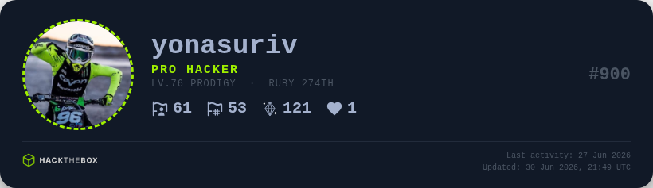

<div align="center" id="madewithlua">
  <picture>
    <source media="(prefers-color-scheme: light)" srcset=".github/assets/metrics-light.png">
    <source media="(prefers-color-scheme: dark)" srcset=".github/assets/metrics-dark.png">
    
  </picture>
  <picture>
    
  </picture>
  <h2>Metrics HTB</h2>
</div>

Your Hack The Box data, wherever you want it — **terminal**, **spreadsheet**, **browser**, or **gitHub profile badges** updated automatically via GitHub Actions.



## Components

| Component | Path | What it does |
|-----------|------|--------------|
| **Badges** | [`src/htb_metrics/`](src/htb_metrics/) | Auto-generated profile badges for your GitHub README |
| **CLI** | [`src/htb_cli/`](src/htb_cli/) | Full HTB workflow from the terminal (machines, flags, labs) |
| **Dashboard** | [`src/htb_dashboard/`](src/htb_dashboard/) | Interactive browser cheat sheet from your Excel spreadsheet |

## Badges — quick start

```bash
git clone https://github.com/yonasuriv/metrics-htb.git && cd metrics-htb
python -m venv .venv && source .venv/bin/activate
pip install -r requirements.txt && playwright install chromium
cp examples/config/.env.example .env   # set HTB_PROFILE_ID
python generate.py --from-env
```

- **12 templates** — classic, terminal, GitHub-style cards, minimal badge, and more
- **Public + optional auth** — works with a public profile; app token unlocks extra API data
- **No fork required** — copy a workflow template into your profile repo

For GitHub Actions (no fork): [Getting started → GitHub Actions](docs/guides/badge/getting-started.md#github-actions-no-fork).

## CLI — quick start

```bash
pip install -r src/htb_cli/requirements.txt
python3 src/htb_cli/htbcli.py auth --token YOUR_TOKEN
python3 src/htb_cli/htbcli.py machines
```

List machines, submit flags, control labs, and view stats — no browser needed. Optional [Kitty](https://sw.kovidgoyal.net/kitty/) terminal for inline avatars.

## Dashboard — quick start

```bash
cd src/htb_dashboard && python3 -m http.server 8080
# Open http://localhost:8080 — edit htb_machines_UPDATE.xlsx to update data
```

Searchable table of pwned machines with technique badges, difficulty colors, and Excel-driven updates.

## Documentation

### Badges (`src/htb_metrics`)

| Guide | Description |
|-------|-------------|
| [Getting started](docs/guides/badge/getting-started.md) | Install, first badge, GitHub Actions |
| [Configuration](docs/guides/badge/configuration.md) | CLI, env, YAML, secrets, cache |
| [GitHub Actions](docs/guides/badge/github-actions.md) | Workflow templates in `examples/workflows/` |
| [Templates](docs/guides/badge/templates.md) | Placeholders and template list |
| [Data sources](docs/guides/badge/data-sources.md) | HTB API endpoints |
| [Development](docs/guides/badge/development.md) | Project layout, tests, contributing |
| [Troubleshooting](docs/guides/badge/troubleshooting.md) | Common errors |

### CLI (`src/htb_cli`)

| Guide | Description |
|-------|-------------|
| [Getting started](docs/guides/cli/getting-started.md) | Install, authenticate, first commands |
| [Usage](docs/guides/cli/usage.md) | Machines, flags, lab control, profile, cache |
| [Configuration](docs/guides/cli/configuration.md) | Config files, cache, avatar sizes |
| [Development](docs/guides/cli/development.md) | Architecture, stack, contributing |
| [Troubleshooting](docs/guides/cli/troubleshooting.md) | Common errors |

### Dashboard (`src/htb_dashboard`)

| Guide | Description |
|-------|-------------|
| [Getting started](docs/guides/dashboard/getting-started.md) | Setup and project layout |
| [Features](docs/guides/dashboard/features.md) | Table, badges, DataTables, Excel loading |
| [Customization](docs/guides/dashboard/customization.md) | Add techniques and tweak styles |
| [Development](docs/guides/dashboard/development.md) | Tech stack and data flow |

Copy-paste templates and badge previews: [`examples/`](examples/README.md) (`config/` + `workflows/` are copyable; `badges/` is preview-only).

## License

See [LICENSE](LICENSE).

<div align="center">


</div>

# HTB CLI

<div align="center">


**Hack The Box from your terminal — no browser required**

</div>

---

## Overview

A fast CLI for Hack The Box: list machines, submit flags, spawn/stop/reset labs, and view profile stats. Built with Python, Rich UI, and optional Kitty terminal inline avatars.

> [!NOTE]
> **Kitty optional:** [Kitty](https://sw.kovidgoyal.net/kitty/) enables inline machine avatars via `kitten icat`. Everything else works in any terminal.

## Quick start

```bash
pip install -r src/htb_cli/requirements.txt
python3 src/htb_cli/htbcli.py auth --token YOUR_TOKEN
python3 src/htb_cli/htbcli.py machines
```

Get a token at [HTB Settings → API Key](https://app.hackthebox.com/account-settings).

## Documentation

Full guides with screenshots live under [`docs/guides/cli/`](/docs/guides/cli/):

| Guide | Description |
|-------|-------------|
| [Getting started](/docs/guides/cli/getting-started.md) | Install, authenticate, first commands |
| [Usage](/docs/guides/cli/usage.md) | Machines, flags, lab control, profile, cache |
| [Configuration](/docs/guides/cli/configuration.md) | Config files, cache, avatar sizes |
| [Development](/docs/guides/cli/development.md) | Architecture, stack, contributing |
| [Troubleshooting](/docs/guides/cli/troubleshooting.md) | Common errors |

## License

MIT — see [LICENSE](/LICENSE).

# HTB Machines CheatSheet

An interactive browser dashboard to visualize every Hack The Box machine you've completed — techniques, difficulty, OS, dates, and writeup links in one searchable table.

## Quick start

```bash
cd src/htb_dashboard
# Open index.html in a browser, or:
python3 -m http.server 8080
```

Edit `htb_machines_UPDATE.xlsx` as you pwn new boxes; reload the page to refresh.

## Documentation

Full guides live under [`docs/guides/dashboard/`](/docs/guides/dashboard/):

| Guide | Description |
|-------|-------------|
| [Getting started](/docs/guides/dashboard/getting-started.md) | Setup and project layout |
| [Features](/docs/guides/dashboard/features.md) | Table, badges, DataTables, Excel loading |
| [Customization](/docs/guides/dashboard/customization.md) | Add techniques and tweak styles |
| [Development](/docs/guides/dashboard/development.md) | Tech stack and data flow |

## License

Personal use — see [Development → License](/docs/guides/dashboard/development.md#license).
