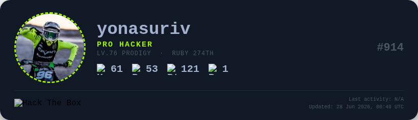

# HTB Metrics

Auto-generated Hack The Box profile cards for your GitHub README.  
Updated daily via GitHub Actions.

## Templates

| Name | Preview | Size |
|------|---------|------|
| `classic` | HTB dark — avatar + stats + ranking | 820px |
| `compact` | Small single-row card | 560px |
| `profile-card` | Full stats grid + all rank tiers | 820px |
| `rank-card` | Focused on legacy / level / season rank | 480px |
| `season-card` | Current season league highlight | 420px |
| `terminal` | Kali terminal aesthetic | 720px |
| `hacker-red` | Black + red accent | 820px |
| `hacker-yellow` | Black + yellow accent | 820px |
| `light` | White/light theme | 820px |
| `minimal` | Single-line inline badge | auto |
| `github-classic` | GitHub-style light card with field rows | 480px |
| `github-plugin` | GitHub dark card with progress bars | 480px |

## Quick Start (GitHub Actions)

1. **Fork or clone this repo into your GitHub profile repository** (the repo named `<your-username>/<your-username>`).

2. **Add your HTB Profile ID as a secret:**
   - Go to your repo → Settings → Secrets and variables → Actions
   - Click **New repository secret**
   - Name: `HTB_PROFILE_ID`
   - Value: your 6-digit HTB profile ID (find it at `https://app.hackthebox.com/profile/overview`)

3. **Choose a template** (optional — defaults to `classic`).  
   Edit `.github/workflows/update-metrics.yml` and change the `default:` under `template:`.

4. **Run the workflow once** to generate your first badge:
   - Go to Actions → Update HTB Metrics → Run workflow

5. **Add to your README:**
   ```markdown
   
   ```

The workflow runs automatically every day at midnight UTC and commits updated PNGs only when the data changes.

## Local Usage

```bash
# Install dependencies
python -m venv .venv && source .venv/bin/activate
pip install -r requirements.txt
playwright install chromium

# Generate (prompts for ID if not set)
python generate.py -p <YOUR_PROFILE_ID>
python generate.py -p <YOUR_PROFILE_ID> -t terminal
python generate.py -p <YOUR_PROFILE_ID> -t profile-card

# Use a config file instead of CLI flags
cp htb-metrics.yml.example htb-metrics.yml
# edit htb-metrics.yml, set your profile_id
python generate.py
```

## Configuration

Config priority: **CLI flags > `HTB_PROFILE_ID` env var > `htb-metrics.yml` > defaults**

| Key | CLI flag | Env var | Default |
|-----|----------|---------|---------|
| Profile ID | `-p` / `--profile` | `HTB_PROFILE_ID` | *(required)* |
| Template | `-t` / `--template` | `HTB_TEMPLATE` | `classic` |
| Output dir | `-o` / `--output-dir` | `HTB_OUTPUT_DIR` | `output` |
| Cache TTL (sec) | `--no-cache` | — | `3600` |

## Troubleshooting

**"Profile ID is required"** — Set the `HTB_PROFILE_ID` secret (Actions) or pass `-p <id>` locally.

**"HTTP 403 / profile is private"** — Your HTB profile must be set to **Public** (Profile → Settings → Privacy).

**"No .badge element found"** — The selected template failed to render. Check that `assets/icons/` contains the SVG files (run `python scripts/download_icons.py`).

**Empty or N/A fields** — Some data is null (e.g., no team, no season activity). Set `hide_if_null: true` in `htb-metrics.yml` to suppress them.

## Data Sources

| Data | Endpoint |
|------|----------|
| Profile + legacy rank | `GET /api/v4/profile/{PROFILE_ID}` |
| Experience level | `GET /api/experience/v1/account/{ACCOUNT_ID}` |
| Season league + rank | `GET /api/v4/season/user/{PROFILE_ID}/ranks` |
| Progress (machines, challenges…) | `GET /api/v4/profile/progress/*/{PROFILE_ID}` |

> All endpoints are **public** — no authentication required. Profile must be set to Public.

## Security

- No HTB credentials are stored or transmitted.
- Only public API endpoints are used.
- Your profile ID is stored as a GitHub secret — it is not exposed in logs or commits.
