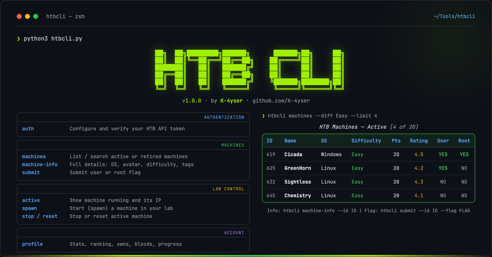
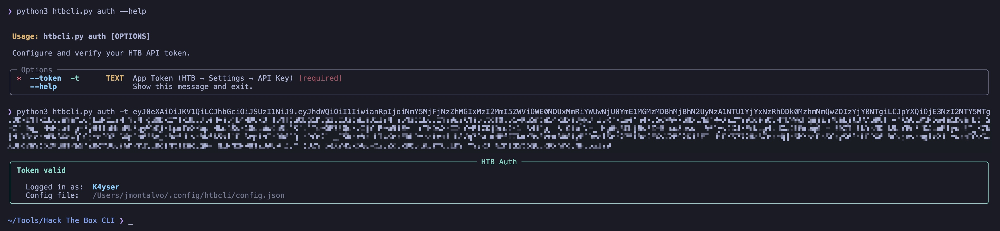
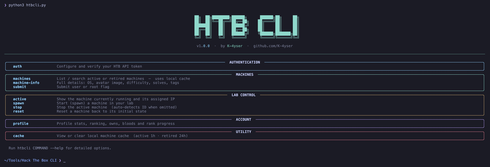

# Getting started

<div align="center">



</div>

HTB CLI is a fast, full-featured command-line tool for interacting with Hack The Box directly from your terminal. List machines, submit flags, start/stop/reset labs, and check your stats — all without opening a browser.

> [!NOTE]
> **About Kitty:** [Kitty](https://sw.kovidgoyal.net/kitty/) is a GPU-accelerated terminal that supports inline images. HTB CLI uses `kitten icat` to render machine avatars. **Don't have Kitty? No problem** — everything works fine; you just won't see avatar images.

## Requirements

| Requirement | Details |
|-------------|---------|
| **Python** | 3.10+ |
| **HTB token** | [Create an app token](https://app.hackthebox.com/account-settings) → API Key → Create App Token |
| **Terminal** | Any terminal (Kitty recommended for images) |
| **Dependencies** | `typer`, `requests`, `rich` |

## Install

From the **metrics-htb** repo root (after `python htbm.py setup`):

```bash
pip install -r src/htb_cli/requirements.txt   # included in root requirements.txt after setup
python htbm.py cli auth --token YOUR_TOKEN
python htbm.py cli machines
```

Or directly:

```bash
python htbm.py cli auth --token YOUR_TOKEN
python htbm.py cli machines
```

## Authenticate

### 1. Get your HTB token

Go to [HTB Settings → API Key](https://app.hackthebox.com/account-settings) and create a new App Token:


Copy the generated token (shown only once):


### 2. Save credentials

```bash
python htbm.py cli auth --token YOUR_TOKEN_HERE
```



> [!IMPORTANT]
> Your token is stored in `~/.config/htbm/cli/config.json` with permissions `600` (owner read/write only).

## First commands

```bash
python htbm.py cli              # Show help menu
python htbm.py cli --help       # Same
python htbm.py cli machines     # List active machines
python htbm.py cli profile      # Your stats
```



## Next steps

- [Usage](usage.md) — machines, flags, lab control, profile, cache
- [Configuration](configuration.md) — config files, cache, avatar sizes
- [Development](development.md) — architecture and contributing
