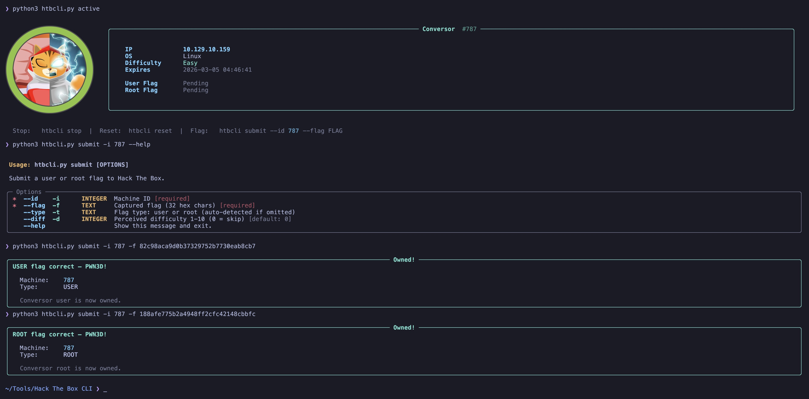
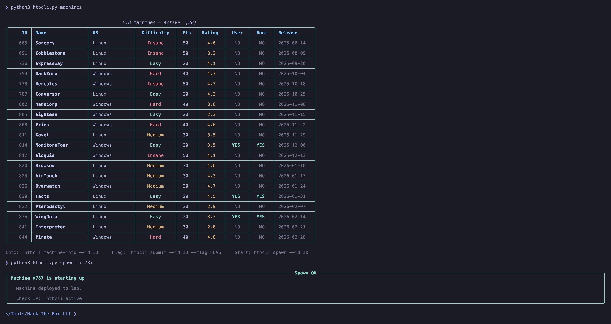
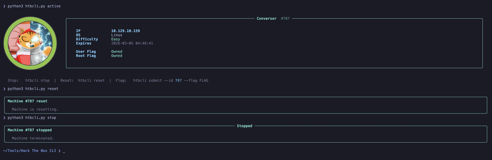

# Usage

All examples assume you run from the repo root. Adjust paths if you installed an alias.

## General

```bash
python3 src/htb_cli/htbcli.py                  # Show help menu
python3 src/htb_cli/htbcli.py --help           # Same
```


---

## Machines

```bash
# List active machines
python3 src/htb_cli/htbcli.py machines

# List retired machines (VIP)
python3 src/htb_cli/htbcli.py machines --retired

# Search by name (active + retired)
python3 src/htb_cli/htbcli.py machines --search "Sau"

# Filter by OS and difficulty
python3 src/htb_cli/htbcli.py machines --os linux --diff Easy

# Show only unowned machines
python3 src/htb_cli/htbcli.py machines --pending

# Show only fully owned machines
python3 src/htb_cli/htbcli.py machines --owned

# Limit results
python3 src/htb_cli/htbcli.py machines --limit 10

# Force refresh (ignore cache)
python3 src/htb_cli/htbcli.py machines --refresh
```


---

## Machine info

```bash
# Detailed view with avatar (Kitty), difficulty, rating, tags, solves
python3 src/htb_cli/htbcli.py machine-info --id 573
```


---

## Submit flags

```bash
# Submit flag (auto-detects user or root based on owned state)
python3 src/htb_cli/htbcli.py submit --id 573 --flag abc123...def456

# Submit explicitly as root
python3 src/htb_cli/htbcli.py submit --id 573 --flag abc123...def456 --type root

# With perceived difficulty (1–10 scale, like HTB)
python3 src/htb_cli/htbcli.py submit --id 573 --flag abc123...def456 --diff 4
```



> [!TIP]
> **Auto-detection:** If you already own the user flag, the next submit goes as root automatically. If both are owned, you get a warning instead of a failure.

---

## Lab control

```bash
# Start a machine
python3 src/htb_cli/htbcli.py spawn --id 573

# Use VIP server
python3 src/htb_cli/htbcli.py spawn --id 573 --vip

# Show active machine + IP
python3 src/htb_cli/htbcli.py active

# Stop (auto-detects active machine)
python3 src/htb_cli/htbcli.py stop

# Reset
python3 src/htb_cli/htbcli.py reset
```




---

## Profile

```bash
# Show your profile stats
python3 src/htb_cli/htbcli.py profile
```

---

## Cache

```bash
# Show cache status
python3 src/htb_cli/htbcli.py cache

# Clear cache
python3 src/htb_cli/htbcli.py cache --clear
```


## See also

- [Configuration](configuration.md) — config paths and avatar sizing
- [Troubleshooting](troubleshooting.md) — common errors
